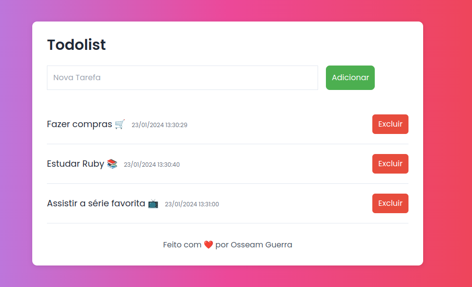

# REQUISITOS

1. Install Ruby 3.3.0

 ## Executar
 
 **comandos de terminal**
 
 `lost@osseamguerra:~$ cd todolist_ruby/`
 
 `lost@osseamguerra:~/todolist_ruby$ bundle install`
 
 `lost@osseamguerra:~$ puma -p 4567`

 *acesse a aplicação em https://localhost:4567*

 
